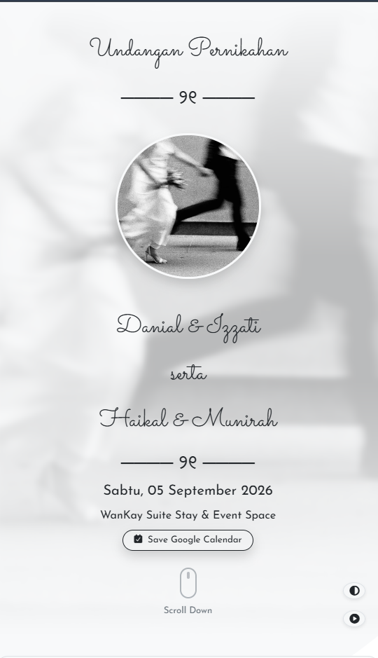
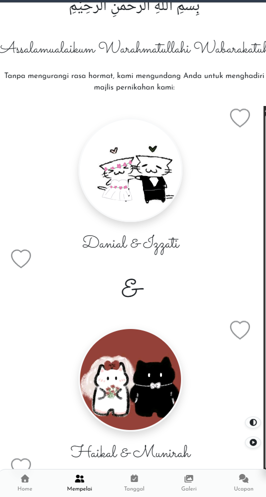
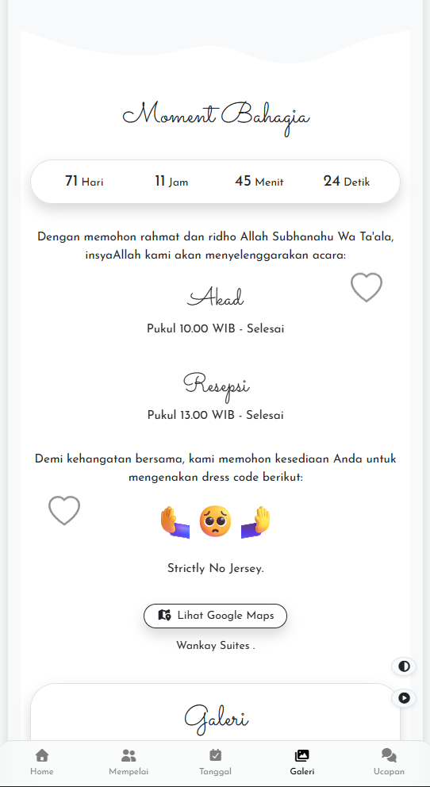
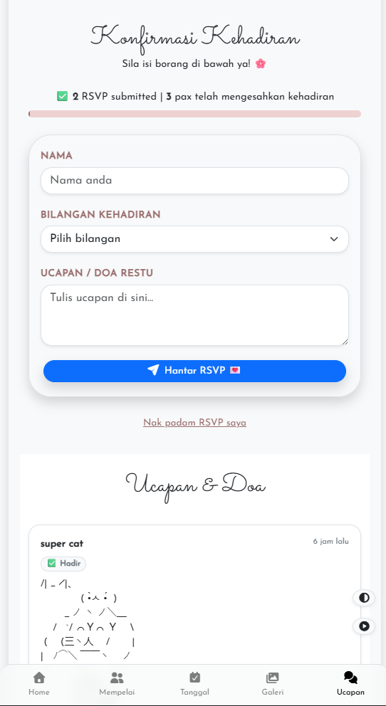

# 💌 Undangan Pernikahan 

2nd version of wtv ts is 

🔗 **Firebase:** [happycuddin](https://console.firebase.google.com/u/0/project/happycuddin-567a9/database/happycuddin-567a9-default-rtdb/data/~2Fwishlist)

---

## ✨ Details

- 🎨 Tema light/dark dengan toggle
- 🎵 Background music dengan fade-in
- 📸 Galeri gambar (carousel)
- ⏳ Countdown timer ke tarikh majlis
- 📝 RSVP & Ucapan/Doa — disimpan terus ke Firebase Realtime Database
- ❤️ Like system untuk setiap ucapan
- 🗑️ Tetamu boleh padam RSVP sendiri
- 💰 Info Love Gift (transfer bank, QR, alamat hadiah)
- 📱 Responsive — optimized untuk mobile (smartphone mode) & desktop

---


## 📸 Screenshot
 
| | |
|---|---|
|  |  |
|  |  |

---
## 🛠️ Tech Stack

- **Bootstrap 5.3.8** — layout & components
- **Font Awesome 7.1.0** — icons
- **esbuild** — bundling JS
- **Firebase Realtime Database** — RSVP & wishlist storage
- **Vercel** — hosting/deployment

---

## 🚀 Setup & Run Locally

Clone repo:

```bash
git clone https://github.com/notpunpun/weddin.git
cd weddin
```

Install dependencies:

```bash
npm install
```

Run development server:

```bash
npm run dev
```

Buka browser di `http://127.0.0.1:8080`.

---

## 🔄 Update Code 

to install:

```bash
git pull
npm install   # kalau ada dependency baru
npm run dev
```

---

## 📁 Structure

```
weddin/
├── index.html          # Main invitation page
├── dashboard.html      # Admin panel (jika guna feature comments)
├── css/                # Stylesheet (guest.css, common.css, animation.css)
├── js/                 # Source JS (sebelum bundle)
├── dist/               # Output bundle (guest.js)
├── assets/
│   ├── images/         # Gambar (gallery, profile, dll)
│   ├── video/          # Video love story
│   └── music/          # Background music
└── package.json
```

---

## 🔥 Firebase Setup

Konfigurasi Firebase ada terus dalam `index.html` (inline script). Struktur data `wishlist`:

```json
{
  "wishlist": {
    "<auto-id>": {
      "nama": "Nama Tetamu",
      "hadir": 1,          // 1 = hadir, 2 = tidak hadir
      "pax": 2,
      "ucapan": "Tahniah!",
      "masa": 1735000000000,
      "likes": 0
    }
  }
}
```

> ⚠️ **Note:** make sure Firebase Realtime Database Rules dah di-set dengan betul (read/write permissions) sebelum live, terutamanya untuk elak abuse pada RSVP/like endpoint.

---

## 📝 Customization

- **Tarikh majlis** — tukar atribut `data-time` pada tag `<body>`
- **Background music** — tukar atribut `data-audio` pada tag `<body>`
- **Dress code / warna** — edit terus dalam section `#wedding-date`
- **Galeri** — ganti `data-src` pada setiap `` dalam carousel section `#gallery`

---

## 🙏 Credits

- Built with ❤️ by **kyo**

---
